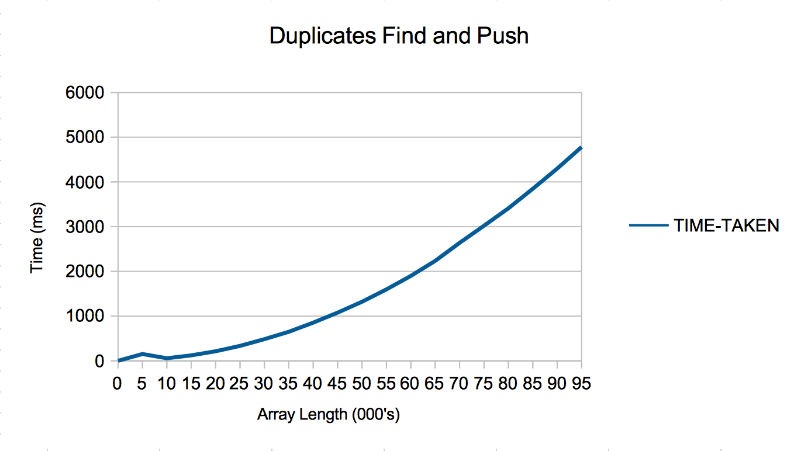
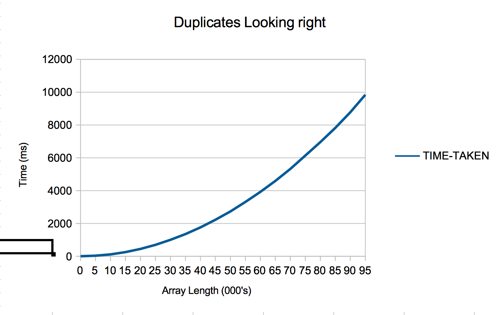

# Duplicates readme

### Duplicate Find and Push

* This was the faster of the two algorithms
* I had a dummy array set up in the algorithm, I then iterated through the array passed as an argument seeing if each element if was in the dummy array, if not then I would push the element into the dummy array. If it was then the iteration would stop and declare duplication.

### Duplicate Find and Push

* This was the first algorithm I wrote
* It simply iterated through the array looking to the right of each element to see if there was another equal to it. Iteration would stop and declare duplication if there was.
